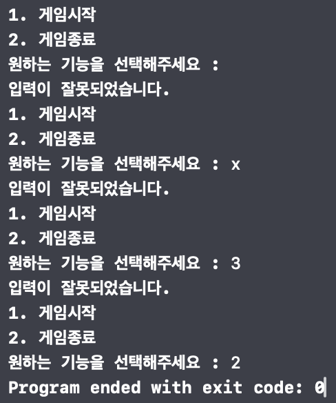
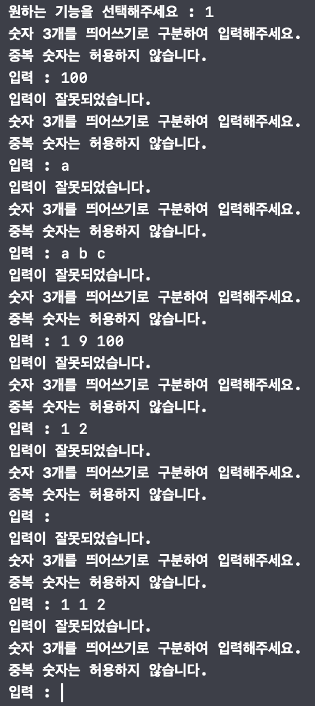
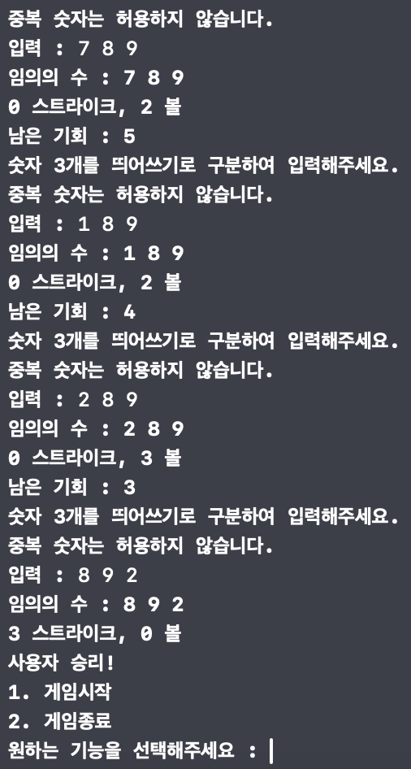
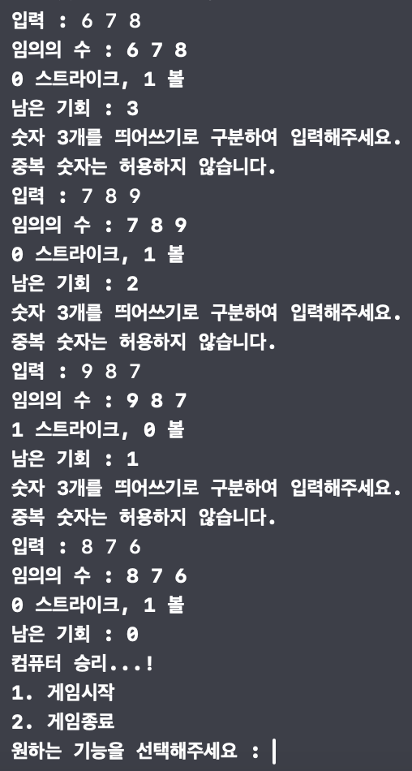

## iOS 커리어 스타터 캠프
### 숫자야구 프로젝트 저장소

### 1. 소개
컴퓨터는 1에서 9까지의 중복되지 않는 임의의 수 3개를 생성하며, 사용자는 중복 없이 3개의 정수를 입력합니다. 사용자가 9번의 기회 동안 3 스트라이크를 달성하면 게임에서 이기고, 그렇지 않으면 컴퓨터가 승리하는 게임입니다.

### 2. 팀원
| [prism](https://github.com/PrismSpirit) | [gama](https://github.com/forseaest) |
| --- | --- |
|  |  |

### 3. 타임라인
| 날짜 | 내용 |
| --- | --- |
| 24.01.03 | Flow Chart 작성, Ground Rules 논의, Step1 코드 작성 |
| 24.01.04 | Step1 코드 마무리, Step1 PR |
| 24.01.05 | Step1 피드백 후 리팩토링, Step2 코드 작성, Step2 PR |

### 4. Flow Chart


### 5. 실행 화면
| 메뉴 선택 | 잘못된 입력 처리 |
| --- | --- |
|  |  |

| 사용자의 승리 | 컴퓨터의 승리 |
| --- | --- |
|  |  |

### 6. 트러블 슈팅
### ✔️ 변수, 함수의 네이밍 관련
- 변수, 함수의 네이밍에 대해서 어려움을 겪었습니다. 함수의 이름을 지을 때에는 get, set을 지양하고 calc처럼 줄여 쓰지 않는 것을 알게 되었습니다. 또한 for문의 반복 상수를 i로 설정해놓는 습관은 반복 횟수가 코드에서 무엇을 의미하는지 명확하게 알기 어렵기에, 명시적으로 이름을 풀어 쓰도록 고쳤습니다.
### ✔️ 중복 숫자 판별
- 임의의 숫자 3개를 중복 없이 추출하는 방법에 대해서 프로젝트 힌트에
```Swift
Int.random(1...9)
```
를 사용해 x~y의 임의의 정수를 만들 수 있다고 나와있어 Set의 원소의 개수가 3이 될때까지 반복문으로 insert하는 방법을 생각했으나, (1...9)를 shuffle하여 앞에서 3개까지만 slice해 사용하는 것이 더 효율적이라고 판단하여 
```Swift
(1...9).shuffled()
```
의 0, 1, 2번째 요소를 추출하는 것을 사용하여 진행하였습니다.

### 7. 참고 자료
- https://www.swift.org/documentation/api-design-guidelines/
- https://developer.apple.com/documentation/swift
