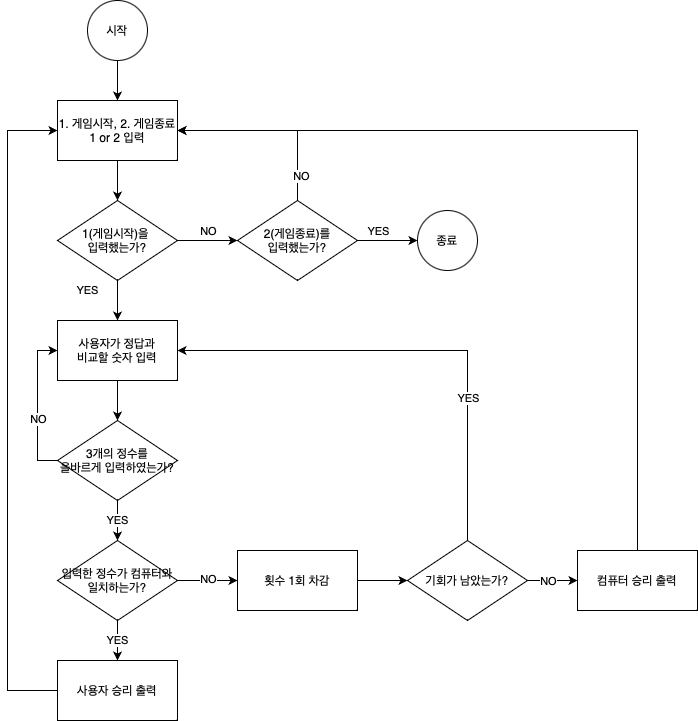
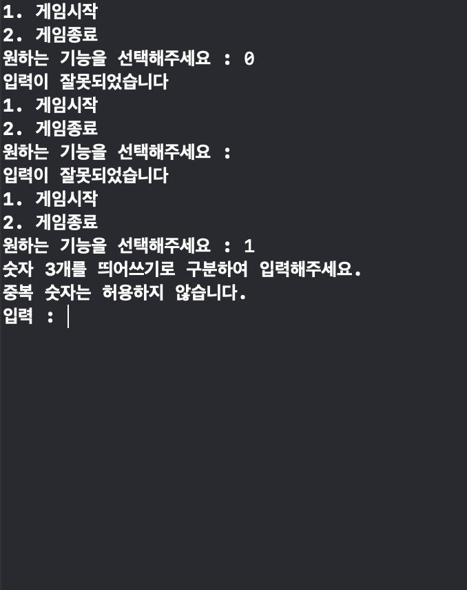
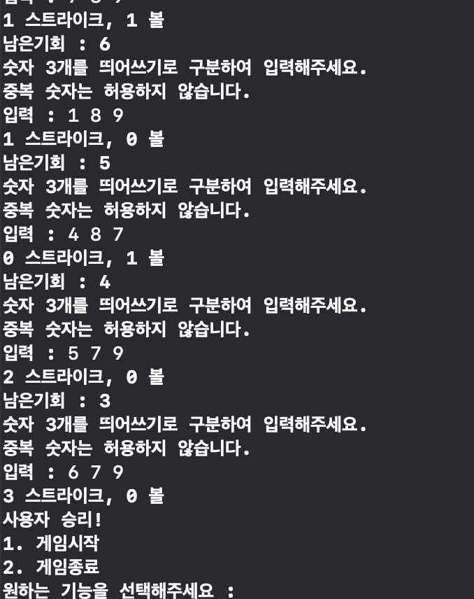
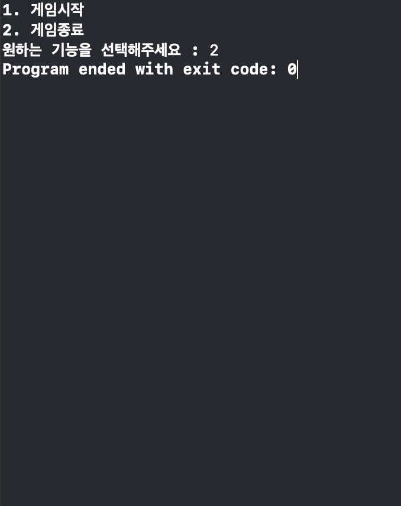

## iOS 커리어 스타터 캠프

### 숫자야구 프로젝트 저장소

- 이 저장소를 자신의 저장소로 fork하여 프로젝트를 진행합니다

### 프로젝트 설명
1. 제목: 숫자야구 프로젝트

2. 소개: 1~9 사이의 서로 다른 3개의 숫자를 입력받아 컴퓨터의 값과 비교하여, 스트라이크와 볼을 판정하여 승패를 결정하는 게임이다.

3. 팀원
- 닉네임 : goat, kaki, 혜모리
- 미모지 : 

- 역할 : 커밋별로 드라이버 1명과 네비게이터 2명으로 번갈아가며 진행
    
4. 타임라인: 시간 순으로 프로젝트의 주요 진행 척도를 표시
- 12/19 (월) : STEP 0 , 순서도
- 12/20 (화) : STEP 2까지 진행 완료 (STEP 1 Review 대기중)
- 12/22 (목) : STEP 1 리뷰를 반영해서 수정 및 STEP 2 PR 완료
- 12/23 (금) : STEP 2 리뷰를 반영해서 수정 진행 중

5. 시각화된 프로젝트 구조(다이어그램 등)  

6. 실행 화면(기능 설명)
- 메뉴 선택 화면 및 메뉴 오류 처리

- 사용자 입력 화면 및 사용자 입력 오류 처리

- 사용자 승리

- 컴퓨터 승리

- 게임 종료

7. 트러블 슈팅
- 에러 처리 : 
에러 처리를 어떻게 해줘야하는지 고민이 많았는데 로빈의 리뷰를 통해 불필요하게 사용된 throws, try 등의 키워드를 찾아내었고 조금 더 깔끔한 코드로 수정이 가능했다.
- 스트라이크, 볼 카운트 처리방식 : for문과 if, else-if문을 사용하여 스트라이크 볼 카운트 기능을 갖춘 함수를 하나로 합쳐주었다.
- git 충돌 : 
step1(main branch) merge 전에 step2 브랜치를 만들고 > step2 브랜치의 코드로 원본 저장소 PR을 보냈더니, 머지된 step1 내용과 step2 내용의 충돌이 일어났다. 깃허브에서 제공하는 Resolve conflicts 기능을 이용하여 처리했다.
- 전역 변수, 지역 변수 : 
리뷰를 통해 불필요하게 많이 선언된 전역 변수를 찾게 되었고 지역 변수와 inout 키워드를 통한 함수 정의를 통해 이를 대체해주었다.
- compactMap : 
map 함수만 이용할 시 Optional 형태로 반환되어 이를 다시 언래핑 해주는 과정이 복잡했는데, 잊고 있던 compactMap을 통해 간단하게 변환이 가능했다.
- Naming : 
이름 짓기는 축약형(Num, Arr 등)을 사용하지 않고, 기능을 나타내는 func의 경우 동사로 시작하여 기능을 설명할 수 있는 이름을 지어야 한다. 배열 이름의 경우 복수형 s나 list를 사용하면 좋다.

8. 참고 링크
- [Swift 공식 문서 Error Handling](https://docs.swift.org/swift-book/LanguageGuide/ErrorHandling.html)
- [GitHub Docs - Resolve merge conflicts](https://docs.github.com/ko/pull-requests/collaborating-with-pull-requests/addressing-merge-conflicts/resolving-a-merge-conflict-on-github)
- [API Design Guidelines](https://www.swift.org/documentation/api-design-guidelines/)
- [compactMap](https://developer.apple.com/documentation/swift/sequence/compactmap(_:))

9. [팀회고](./팀회고.md)
