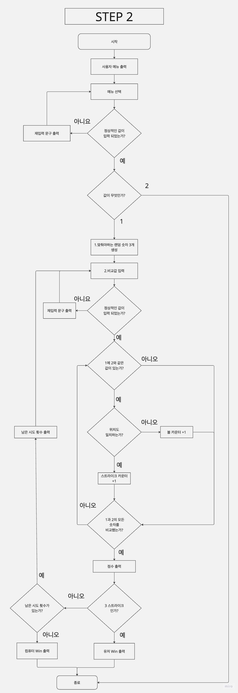
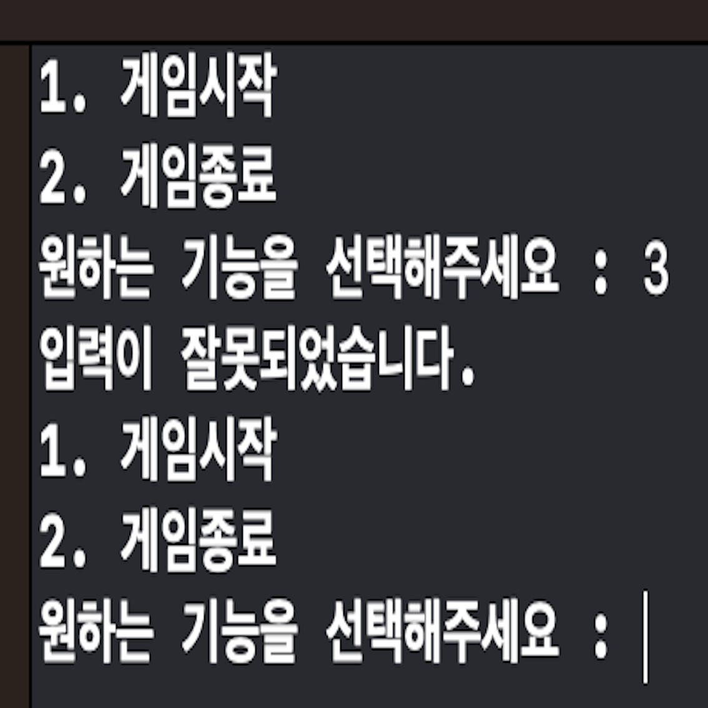
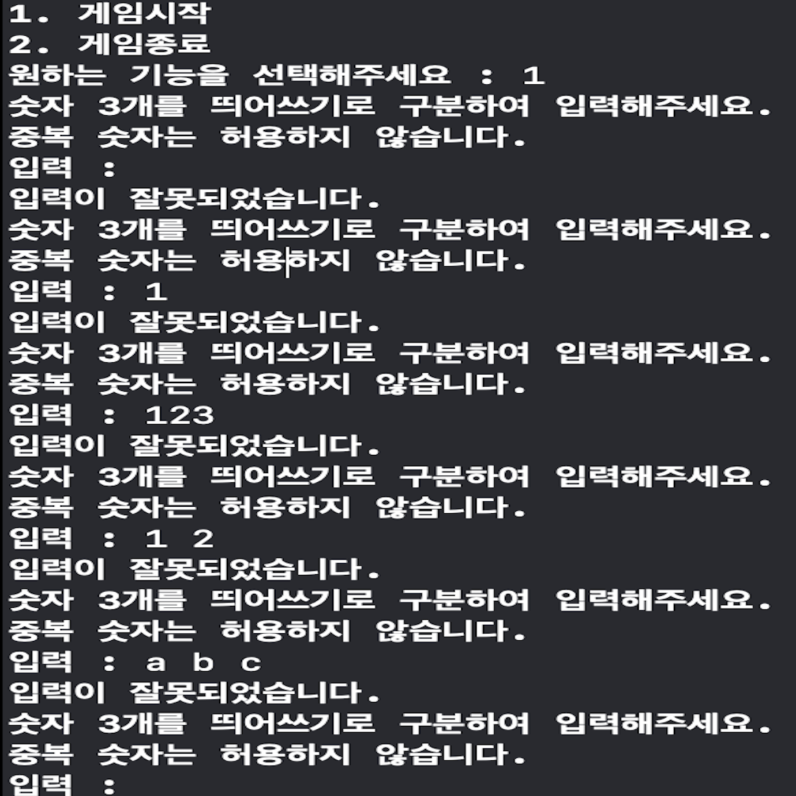
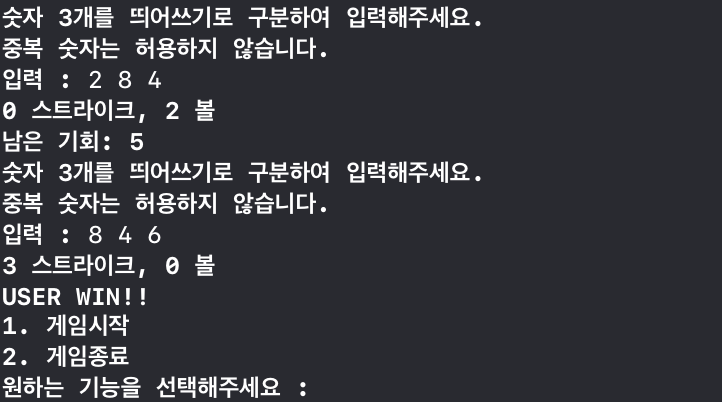
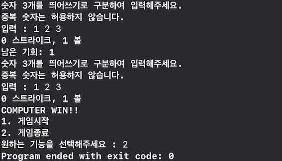

### 숫자야구 프로젝트 저장소

## 목차
[1. 제목](#1-제목)  
[2. 소개](#2-소개)  
[3. 팀원](#3-팀원)  
[4. 타임라인](#4-타임라인)  
[5. FlowChart](#5-FlowChart)  
[6. 실행 화면(기능 설명)](#6-실행-화면(기능-설명))  
[7. 트러블 슈팅](#7-트러블-슈팅)  
[8. 참고 링크](#8-참고-링크)  
[9. 팀회고](#9-팀회고)  

## 1. 제목
- 야구숫자게임

## 2. 소개
- 9번의 기회 안에 컴퓨터의 임의의 수 3개를 맞추는 게임이다.

## 3. 팀원
|redmango|DasanKim|
|:------:|:------:|
|||
|Driver, Navigator|    Driver, Navigator|

## 4. 타임라인
|날짜|내용|
|:--:|--|
|2023.04.24.| 순서도 고민|
|2023.04.25.| 랜덤한 정수를 생성하는 함수 및 숫자비교 함수 구현|
|2023.04.26.| 전체적인 리펙토리 진행|
|2023.04.27.| 사용자에게 숫자 3개 입력받는 함수 및 메뉴 선택하는 함수 구현|
|2023.04.28.| 입력 검증을 위한 정규식 함수 구현|

## 5. FlowChart

<details>
<summary>STEP 2 순서도</summary>
<div markdown="1">



</div>
</details>


## 6. 실행 화면(기능 설명)
| 구분 | 비정상 입력 | 사용자 승리 |컴퓨터 승리 |
| :--------: | :--------: | :--------: | :--------: |
| 실행 화면 | |  |   |
| 화면 설명 | 공백, 3개 미만의 숫자, 1~9이외의 숫자, 띄어쓰기 미준수, 중복숫자등 잘못된 입력일 경우 '입력이 잘못되었습니다' 출력| 사용자가 9번 이내에 정답을 맞추면 userWin 출력 | 사용자가 9번 이내에 정답을 맞추지 못하면 computerWin 출력 |


## 7. 트러블 슈팅
### 1. 짝프로그래밍
#### 🟧 문제점
- 짝프로그래밍이 처음이라 처음엔 `10~15분씩` 돌아가면서 하였더니 commit 단위가 애매해졌다.
-- 따라서 `기능별`로 돌아가면서 짝프로그래밍을 하였다.
-- 짝프로그래밍을 할 때, 시간과 기능별 중 어떤 것을 기준으로 하는 것이 좋을지 고민이 되었다.

#### 🟩 해결책
- 브로디와 로웬의 조언으로 짝프로그래밍 **시간을 늘려가면서 commit 단위를 맞춰보기로** 하였다.

### 2. 네이밍 고민

대부분의 함수와 변수 네이밍에서 고민을 하였으나 가장 오랜시간 고민했던 것들을 아래와 같다.
#### 🟧 문제점 1
- compare 함수의 전달인자 이름을 and, to, with 중에 어떤 전치사를 사용할지 고민되었다.
#### 🟩 해결책 1
- **compare(A ,and B)**
A와 B가 동등한 상태에서 비교된다는 점을 감안하여 and 선택하였다.
#### 🟧 문제점 2
- computerRandomNumbers vs. hiddenRandomNumbers
- "유저가 숨겨진 번호를 맞춘다는 행동"에 초점을 두어 `hiddenRandomNumbers`으로 정하였으나, 의미가 모호하다는 피드백을 받았다.
#### 🟩 해결책 2
- “유저의 행동”이라는 1인칭 시점보다 **“게임을 누구와 하느냐”** 로 3인칭 시점에서 생각해보았을 때 유저와 컴퓨터의 대결이므로, computerRandomNumbers가 hiddenRandomNumbers보다 직관적인 것 같다는 결론을 내려 `computerRandomNumbers`로 수정하였다.

### 3. String to Int
#### 🟧 문제점
- String에서 Int로 형변환시 String값이 Int로 변환될 수도, 안될 수도 있어 Ints (공백 및 숫자가 아닌 값이 있을 수 있으므로) 옵셔널 처리를 해야하므로 처음엔 아래와 같이 처리하였다. 하지만 for문이여서 map 고차함수로 코드를 좀 더 간결하게 할 수 있을 것 같은데... 라는 고민이 계속 남았다.
``` swift
for input in userStringInputs {
        userIntInputs.append(Int(input) ?? 0)
}
```
#### 🟩 해결책 
- 한참 나중에서야 수소문 끝에 알게된 `compactMap`. 이렇게 편리한 함수가 있었다니...?
```swift
validUserInputs = userInput.split(separator: " ").compactMap{ Int($0) }
```

### 4. 코딩 컨벤션
#### 🟧 문제점
- 아래와 같이 우리도 모르게 타입 어노테이션과 타입 추론을 혼용하여 사용였다.
``` swift
let gameResult = compare(hiddenRandomNumbers, and: userRandomNumbers) //타입추론
let strikeCount: Int = gameResult.strikeCount
let ballCount: Int = gameResult.ballCount
```
#### 🟩 해결책
- 둘 중에 타입 어노테이션을 사용하자는 약속을 만들고, 약속한 코딩 컨벤션을 지켜서 통일성을 높이기로 하였다.
``` swift
let gameResult: (strikeCount: Int, ballCount: Int) = compare(hiddenRandomNumbers, and: userRandomNumbers)
let strikeCount: Int = gameResult.strikeCount
let ballCount: Int = gameResult.ballCount
```
    
## 8. 참고 링크
- [Swift API Design GuideLines - Naming](https://www.swift.org/documentation/api-design-guidelines/)
- [The Swift Programming Language - optionalChaining](https://docs.swift.org/swift-book/documentation/the-swift-programming-language/optionalchaining/)
- [Apple Developer Documentation - compactMap](https://developer.apple.com/documentation/swift/sequence/compactmap(_:))


## 9. 팀회고
### 우리팀이 잘한 점👍
- 실력과 상관없이 서로의 의견을 자유롭게 나누면서 좋은 방향으로 갈 수 있도록 함께 고민하였다.
- 좋은 의견이 있을 경우 적극적으로 반영하였다.
- 그라운드룰 안에서 서로의 생활 패턴을 배려하고 존중하였다.

### 우리팀 개선할 점🤔
- 코딩 컨벤션을 조금 더 구체적으로 고민해야겠다.
- 공식 문서를 더 자주 봐야겠다.
- PR 및 회고 작성을 위해서 트러블 슈팅을 바로바로 적어놓으면 좋을 것 같다.
- STEP 진행에 조급하지 않고 깊이 학습하는 것에 중점을 둬야겠다.

### 서로에게 좋았던 점 피드백
#### To. dasan
- 친절하고 사려깊고 배려심이 높아요
#### To. redmango
- 친절하고 배려심이 깊고 이야기를 잘들어줘요. 잘 웃어줘서 용기가 났습니다. 엣헴도 잘해요
- 집중할 타이밍과 쉴 타이밍을 잘 알려줘요
- 코딩할 때 구조적인 정리(순서도)도 잘하고, Xcode 단축키도 잘 알고 있어서 많이 배웠습니다!

### 서로에게 아쉬웠던 점 피드백
#### To. dasan
- 다산 쉬는 시간 좀 가져요
#### To. redmango
- 망고 건강챙겨요 일찍 자라구여
- 좋았던 피드백 더 써주세요🤨
