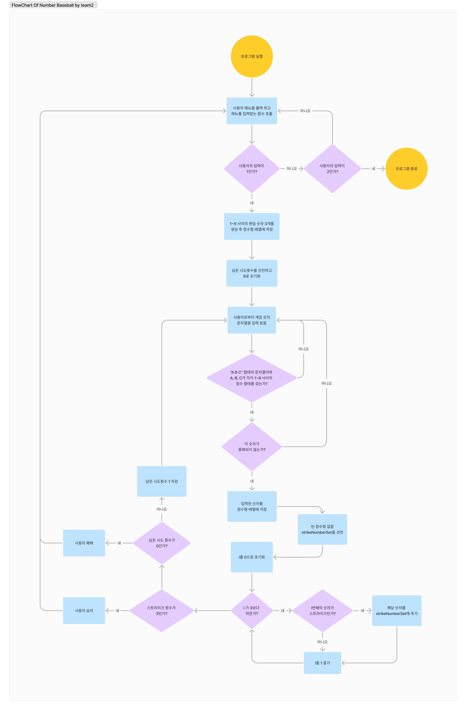

## iOS 커리어 스타터 캠프
### 숫자야구 프로젝트 저장소

### 1. 소개
컴퓨터는 1에서 9까지의 중복되지 않는 임의의 수 3개를 생성하며, 사용자는 9번의 기회 동안 중복없이 3개의 정수를 입력하여 3 스트라이크를 달성하면 게임에서 이기고, 그렇지 않으면 컴퓨터가 승리하는 게임입니다.

### 2. 팀원
| [prism](https://github.com/PrismSpirit) | [gama](https://github.com/forseaest) |
| --- | --- |
|  |  |

### 3. 타임라인
| 날짜 | 내용 |
| --- | --- |
| 24.01.03 | Flow Chart 작성, Ground Rules 논의, Step1 코드 작성 |
| 24.01.04 | Step1 코드 마무리, Step1 PR |
| 24.01.05 | Step1 피드백 후 리팩토링, Step2 코드 작성 |

### 4. Flow Chart

### 5. 실행 화면

### 6. 트러블 슈팅
