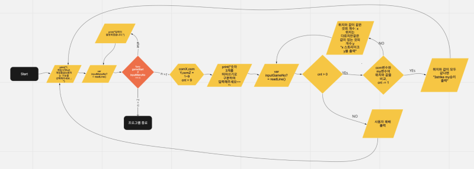

## 숫자야구 프로젝트 저장소

###### iOS 커리어 스타터 캠프
###### Created by. Seunggi & Soll (3A)

### 게임 규칙

#### 숫자야구 게임규칙

- 참고 : 숫자야구 게임은 실제 야구 게임과는 거리가 있습니다
- 입력할 수 있는 수의 범위는 1부터 9까지입니다
- 우선 컴퓨터는 중복되지 않은 임의의 수 3개를 생성합니다
    - 임의의 수 3개는 게임 도중 변경되지 않습니다
    - 새로운 게임이 시작되면 임의의 수 3개는 변경합니다
- 게임이 끝날 때 까지 사용자에게 **중복된 수 없이** 3개의 정수를 입력받습니다
- 사용자는 9번의 기회 안에 3 스트라이크를 얻어내면 승리합니다
    - 9번의 기회 안에 3 스트라이크를 얻어내지 못하면 컴퓨터가 승리합니다

#### 스트라이크 / 볼 판정

- 스트라이크와 볼은 사용자가 입력하는 수와 컴퓨터가 만들어낸 임의의 수의 비교를 통해 판정합니다
- 사용자가 입력한 수와 컴퓨터가 만든 수, 그리고 그 수의 위치가 모두 일치하면 스트라이크
- 사용자가 입력한 수와 컴퓨터가 만든 수가 일치하지만, 위치가 다른 경우 볼
- 판정 예
    - 회차. [컴퓨터 생성 숫자] - [사용자 입력 숫자] - 판정 결과 - 비고
    - 1. [8 2 4] - [1 2 3] - 1스트라이크 0볼
    - 2. [8 2 4] - [1 4 5] - 0스트라이크 1볼
    - 3. [8 2 4] - [4 2 6] - 1스트라이크 1볼
    - 4. [8 2 4] - [6 2 4] - 2스트라이크 0 볼
    - 5. [8 2 4] - [7 2 4] - 2스트라이크 0 볼
    - 6. [8 2 4] - [8 2 4] - 3스트라이크 0 볼 - 사용자 승리!
    - 만약 9회차까지 사용자가 3스트라이크를 내지 못하면 사용자 패배

### Flow chart

### Naming
1. comX, comY, comZ: 컴퓨터가 생성하는 랜덤한 정수 3개를 담아둘 상수
2. userX, userY, userZ: 유저가 입력한 정수 3개를 담아둘 변수
3. tempNo, tempArray: 함수 내에서 임시적으로 값을 할당하기 위한 정수형, 배열 타입의 변수와 상수
4. comArray: 컴퓨터가 생성한 랜덤한 정수 3개를 담아둔 배열 상수
5. userArray: 유저가 입력한 정수 3개를 담아둔 배열 상수
6. strike, ball: 스트라이크와 볼 수
7. count: 유저가 한 번의 게임당 시도할 수 있는 횟수

### Step 1

#### 기본 기능
1.makeThreeRandomNo: func = 겹치지 않는 무작위의 3개의 수를 배열로 생성하여 반환.
2.compareComUser: func = 컴퓨터가 생성한 수와 유저의 수를 비교하여 스트라이크와 볼을 반환

### Step2
