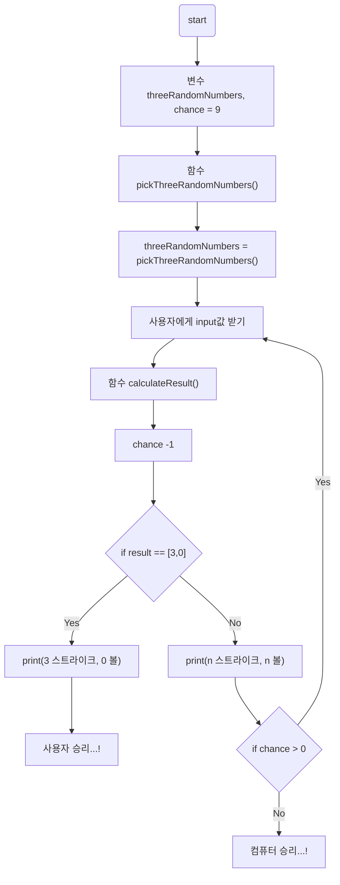

## iOS 커리어 스타터 캠프

### 숫자야구 프로젝트 저장소

- 이 저장소를 자신의 저장소로 fork하여 프로젝트를 진행합니다

```mermaid
graph
A(start) -->B["변수 threeRandomNumbers, chance = 9"]
B --> C["함수 pickThreeRandomNumbers()"]
C --> D["threeRandomNumbers = pickThreeRandomNumbers()"]
D --> DE[사용자에게 input값 받기] --> E["함수 calculateResult()"]
E --> F["chance -1"]
F --> G{"if result == [3,0]"}
G -->|Yes| GG["print(3 스트라이크, 0 볼)"] --> HH[사용자 승리...!]
G -->|No| GH["print(n 스트라이크, n 볼)"] --> I{if chance > 0}
I --> |Yes| DE
I --> |No| HI[컴퓨터 승리...!]
```
