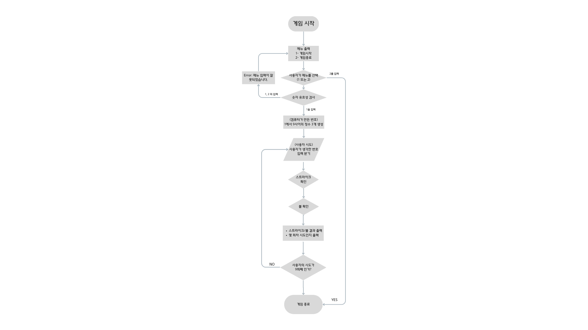

## iOS 커리어 스타터 캠프

### 숫자야구 프로젝트 저장소

- 이 저장소를 자신의 저장소로 fork하여 프로젝트를 진행합니다

### 플로우 차트


---

### 프로젝트 소개
Swift 언어를 사용하여 구현된 숫자야구 게임입니다. 컴퓨터가 임의의 숫자 3개를 생성을 하고 사용자는 9번의 기회 동안 정답을 맞추어야 합니다. 매번 시도할 때마다 사용자에게 스트라이크와 볼의 개수를 표시하여 결과를 알려줍니다.

### 게임 진행 방법
프로젝트 실행하면 게임이 시작되며 컴퓨터가 임의의 숫자를 만듭니다. 사용자는 9번의 기회 동안 숫자를 맞추어야 합니다.

### 게임 규칙
1. 스트라이크 : 컴퓨터가 생성한 숫자와 사용자가 생성한 숫자의 값이 같고 순서가 같으면 스트라이크로 판정합니다.
2. 볼 : 생성한 숫자의 값은 같으나 순서가 다르면 볼로 판정합니다.
3. 스트라이크 3개면 사용자가 이깁니다.
4. 9번의 기회에서 스트라이크 3개를 성공시키지 못하면 컴퓨터가 승리합니다.

---

### 코드 구조
#### 함수: generateRandomNumbers
```
var setNumber = Set<Int>()
  
  while setNumber.count < 3{
      let randomNumber = Int.random(in: 1...9)
```
- `Set<Int>()` 임의의 숫자들이 중복되지 않도록 `set` 을 이용합니다.
> `Set` 이란? Swift의 자료구조 중 하나인 `Set`, 컬렉션 타입입니다. 순서가 중요하지 않거나, 항목이 한번만 표시되도록 해야하는 경우 배열 대신 집합을 사용할 수 있습니다. 배열과 달리 중복 요소를 허용하지 않고, 해시를 통해 값을 저장하기 때문에 배열에 비해 검색속도가 빠릅니다.
- `Int.random(in: 1...9)` 으로 1에서 9까지의 서로 다른 임의의 숫자 3개를 생성합니다.

#### 함수: judgeResult
```
for i in 0...2 {
    if (comNumbers.contains(userNumbers[i]) && comNumbers[i] == userNumbers[i]) {
        countStrike += 1
    } else if (comNumbers.contains(userNumbers[i])) {
        countBall += 1
    }
}
```
- 컴퓨터의 수(`comNumbers`)와 사용자의 수(`userNumbers`)를 비교하여 스트라이크와 볼을 판단합니다.

#### 함수: startGame
```
  comNumbers = [Int]()
  userNumbers = [Int]()
  attemp = 9
```
- 게임을 초기화하고 시작합니다.

### 예시
```
// 컴퓨터가 생성한 임의의 숫자
comNumbers: [1,5,9]
userNumbers: [2,1,9]

// 결과
1 스트라이크, 1 볼
남은기회 : 8

// ...

남은 기회 : 0
컴퓨터 승리!
```

---

### 다음 과제
- 게임시작/게임종료 메뉴를 생성합니다.
- 메뉴에 잘못된 입력이 있을 경우 예외처리를 해야 합니다.
- 사용자로부터 직접 3개의 숫자를 입력받을 수 있어야 한다.
