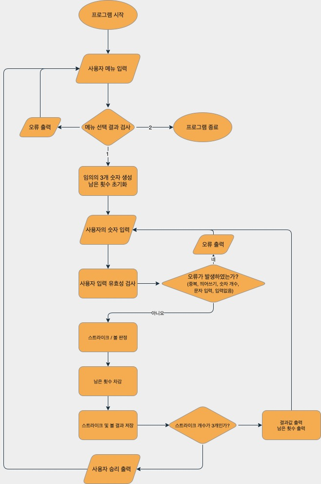

## iOS 커리어 스타터 캠프

### 숫자야구 프로젝트 저장소

### STEP 1

- 진행상황 : 
  STEP1 완료 후, STEP 2 코딩 방향 상의 중
- 해결되지 않은 점 : 
  중간 3 Strike가 된 경우, break를 통해서 while문을 종료하도록 하지 못함
- 조언을 얻고 싶은 점 : 
  결과를 프린트하는 함수를 반복문 외부에서 사용하여 반복문을 종료 시키지 못하는 문제에 대해서 결과 호출을 외부 함수로 정의하는 것과 직접 호출하는 것에서 어떤 차이가 있는지 궁금합니다.