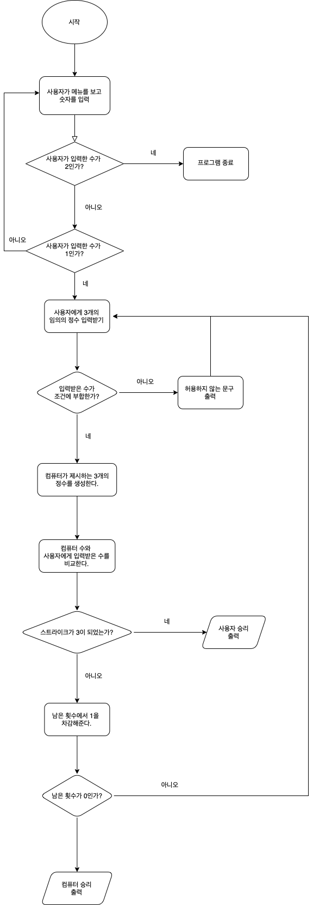

## iOS 커리어 스타터 캠프

### 숫자야구 프로젝트 저장소

- 이 저장소를 자신의 저장소로 fork하여 프로젝트를 진행합니다



# 숫자야구 프로젝트 저장소
> 프로젝트 기간 2022.04.12~2022. 팀원: @나이든별 @yeton /리뷰어: @malang-malang
> 
## step1 기능 구현

* 변수 computerNumber와 userNumber을 생성해 각각 컴퓨터에서 생성한 임의의 수와 사용자에게 입력받은 임의의 수를 Set에 담음
* 반환값이 numbers인 함수 makeRandomNumber()을 선언해 numbers안에 3개의 수가 찰 때까지 while문을 돌려줌
* 1번에서 Set으로 받아준 것을 추후에 인덱스 비교를 하기 위해서 array로 변환해 타입캐스팅을 해줌
* compareNumbers() 함수를 생성해 사용자 입력 수와 컴퓨터 수를 비교. 이때 함수의 마지막 부분에서 남은 기회가 아직 있고, 승리하지 않은 경우일 때는 다시 입력이 진행되도록 compareNumbers() 함수를 재귀 호출해주고, 이전 실행되던 함수는 return 되도록 해줌
* countStrike() 함수와 countBall() 함수는 각자 스트라이크와 볼의 개수를 반환해주는 함수로 생성함
* 마지막에 compareNumbers() 함수를 호출하여 남은횟수가 0 혹은 승리가 될 때까지 함수가 반복되도록 함

## 고민했던 것들
1. 사용자와 컴퓨터에게 중복되지 않은 3개의 정수를 입력받는 방법을 고민

첫 번째로 생각한 방법은 `set`으로 수를 입력받아 중복이 되지 않도록 한 뒤 추후에 array로 변경해주는 방법이었고, 두 번째 생각한 방법은 처음부터 array로 받지만, 중복이 되지 않도록 contains 등의 조건을 설정해주는 방법이었다.
우리팀은 `set` 개념을 사용해보고 싶어서 첫 번째 방법을 선택.

2. 네이밍 시 전달인자 레이블에 대해 고민

swift 공식 문서의 naming 파트를 읽고, 코드를 쉽게 읽기 위해서 전달인자 레이블을 활용한다는 것을 알게되었고,
`compareNumbers(in: userNumberList, with: computerNumberList)` 이런식으로 코드를 작성하여
*"userNumberList안의 숫자를 computerNumberList 숫자와 비교한다."* 와 같은 의미로 해석되도록 써주었음

함수 안에서 다시 자기자신인 함수를 재귀 호출해주고, 조건이 해당되면 return을 해주는 방법이 괜찮은 방법인지 궁금.

```swift=
func compareNumbers() {
 compareNumbers()
  return
}
```

위와 같은 형태임.
사용하면 굉장히 편한 것 같은데, 실제로 이렇게 써도 문제가 되지 않는지...? 궁금 🤔


## 배운 개념
### forEach와 for의 차이점
* for문: for문의 반복은 코드의 흐름 내에서 직접 수행이 되고, continue 혹은 break 키워드를 사용하여 언제든지 다음 요소로 건너뛸 수 있다.
```swift
for article in articles {
        guard !article.isDraft else {
            // Immediately skip to the next element.
            continue
        }
    
        results.append(article)
```
* forEach문: for문과 비슷하지만, 일단 반복이 시작하면 멈출 수 없기 때문에 폐쇄의 기능을 이용한다. 또한 오류가 일어날 경우 오류를 던질 수 있도록 되어있다. for문 정도의 강력한 통제력이 필요하지 않다면, forEach을 사용한다. 
```swift
class ArticleGroupViewController: UIViewController {
    private let articles: [Article]
    
    ...

    override func viewDidLoad() {
        super.viewDidLoad()
        ...
        articles.forEach(addArticleView)
    }

    private func addArticleView(for article: Article) {
        let articleView = ArticleView()
        ...
        view.addSubview(articleView)
    }
}
```


## PR 후 개선사항
1.
```swift=
임의의 수 : [7, 2, 6]
임의의 수 : 7 2 6
```
아래처럼 구현해주기 위해서 방법들을 찾아봤다. 방법은 여러가지가 있었다. 
- 1번째 방법
```swift=
let array = [7,2,6]
print("임의의 수 : ", array[0], array[1], array[2])
// separator는 " ", terminator는 "\n"으로 기본값이 있으므로 따로 적지 않았다.
// 7 2 6 출력
```
- 2번째 방법
```swift=
let array = [7,2,6]
print("임의의 수 : \(array[0]) \(array[1]) \(array[2])")
```
- 3번째 방법
```swift=
print("임의의 수 : ",terminator: "")
for i in 0...array.count-1 {
    print(array[i], terminator: " ")
}
```
이건 좀 복잡해보인다.


## step2 기능 구현
- 사용자 메뉴 출력 함수 작성 및 내부 오류 검증 과정 구현 
- 게임 숫자를 입력받는 함수 작성 및 사용자 입력을 검증하는 기능 구현
- 게임이 끝났을 때 메뉴를 불러오는 기능 구현

# 고민했던 것들
1. components(separatedBy:" ")로 입력받은 경우

```swift=
let userData = inputString.components(separatedBy: " ")
    if verifyUserInput(userData) {
        for letter in userData {
            userNumberList.append(Int(letter) ?? 0)
        }
        return
    } else {
        print("입력이 잘못되었습니다")
        userInput()
        return
    }
```
위의 코드를 간단하게 얘기하면, 사용자로부터 2 3 4 형태로 입력을 받았을 때, 저 요소를 하나씩 배열에 넣는 것을 표현한 것이다.
먼저 2 3 4 라는 문자열이 담겨있는 userData에서 문자를 for문으로 하나씩 꺼내와서 userNumberList라는 배열에 담았다.
그런데 이때, 2 3 4 는 int형이 아니라 character형이기 때문에 int로 변환해주어야한다. 이 생각을 처음부터 못해서 나중에 수정해줬다.

2. guard let의 사용
```swift=
for letter in userData {
        guard let number = Int(letter),
              number > 0,
              number < 10 else {
                  return false
              }
    }
```
guard let의 첫 번째 조건을 쓴 이유는 ~~letter가 Int로 형 변환이 가능해서 number 변수에 담길 수 있다면~~ 이라는 조건을 주기 위해서이다.
그 이유는 letter가 a,b와 같이 Int형으로 변환될 수 없는 문자일 수 있기 때문이다. 이런 생각이 처음엔 잘 안든다...


## 배운 개념
### 변수명 잘 짓기
하나의 객체나 인스턴스는 단수, array 등 타입은 복수로 써주는 것이 좋다.
```
for album in albums {

}
```
위와 같은 코드를 자주 사용하므로 지켜주면 좋다.


## PR 후 개선사항

