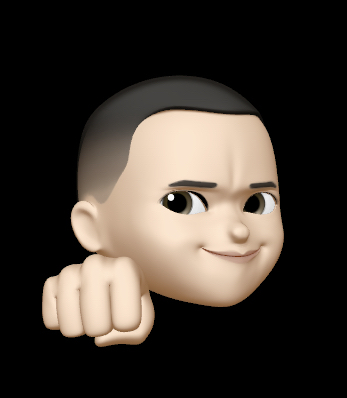
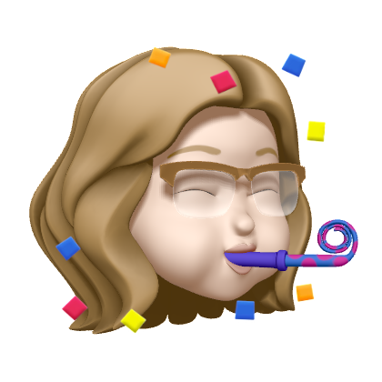
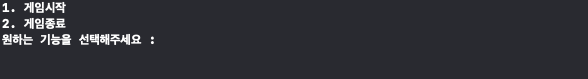
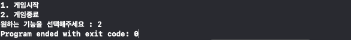
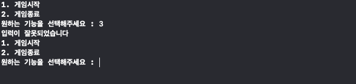
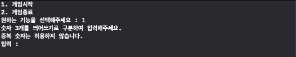
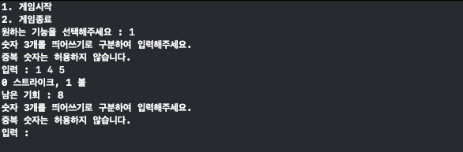
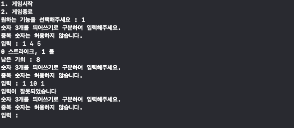
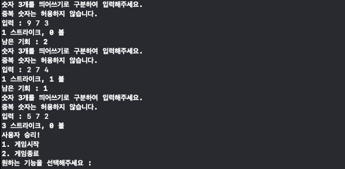
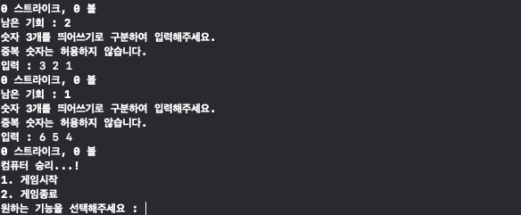

## iOS 커리어 스타터 캠프

### 숫자야구 프로젝트 저장소

1. 제목: 숫자야구 게임

2. 소개: 
사용자로부터 정수 3개를 입력 받은 뒤, 컴퓨터가 랜덤으로 생성한 정수 3개와 비교하여 스트라이크/볼을 카운트하고 승리 여부를 결정하는 게임입니다.
사용자가 입력한 숫자가 컴퓨터의 숫자 리스트에 포함되어 있지만 위치(순서)가 다를 경우는 볼로 카운팅되며, 숫자와 위치 모두 동일할 경우 스트라이크로 카운팅됩니다. 사용자는 총 9번의 도전을 할 수 있습니다.
사용자가 스트라이크 3개를 얻을 경우, 즉 컴퓨터의 숫자 리스트와 완전히 일치하는 수를 입력할 경우 사용자가 승리하며, 9번의 기회동안 3 스트라이크를 얻지 못하면 컴퓨터가 승리합니다.

3. 팀원
- 저스버그(JusBug)

- 맥스(maxhyunm)

4. 타임라인
- 4/24: 순서도 작성
- 4/25: 짝프로그래밍 진행 - STEP 1 구현 완료 후 PR
- 4/26: STEP 1 리뷰 기반으로 수정 진행
- 4/27: 짝프로그래밍 진행 - STEP 2 구현 완료 후 PR
- 4/28: STEP 2 리뷰 기반으로 수정 진행

5. 시각화된 프로젝트 구조(다이어그램 등)

6. 실행 화면(기능 설명)

- 게임을 실행하면 처음 뜨는 메뉴 출력창입니다. 원하는 메뉴를 입력 후 엔터를 치면 해당 메뉴를 실행합니다.

- 2를 입력할 경우 게임이 바로 종료됩니다.

- 1과 2 이외의 내용을 입력할 경우 오류메시지를 출력합니다.

- 1을 입력할 경우 게임이 시작됩니다. 1부터 9 사이의 각기 다른 정수 세 개를 입력할 수 있습니다.

- 정수 세 개를 입력하면 스트라이크와 볼 여부를 판단합니다.

- 양식에 어긋나는 내용을 입력하면 오류메시지를 출력합니다.

- 3개의 스트라이크를 얻어내면 사용자가 승리하고, 메인 메뉴를 다시 출력합니다.

- 9번의 기회동안 3 스트라이크를 얻지 못하면 컴퓨터가 승리하고, 메인 메뉴를 다시 출력합니다.

7. 트러블 슈팅
- 2단계를 초과하여 탭을 쓸 수 없는 부분에 대하여 1차적으로 난관에 부딪혔습니다. while과 for문을 활용해 해결했던 문제들을 어떻게 하면 좀 더 간편하게 해결할 수 있을지 많은 고민을 했고, compactMap과 filter 등 고차함수를 활용하는 것에서 해결책을 얻었습니다.
        - for문을 돌리지 않고 두 배열을 비교하기 위해 처음에는 Set의 교집합, 차집합을 활용하고자 했습니다. 다만 그렇게 하면 배열의 순서를 비교할 수 없다는 단점이 있었습니다. 때문에 고민 끝에 enumerate()를 활용, 인덱스와 요소를 한번에 비교하는 방식을 활용하였습니다.
- 고차함수가 몇 차례 들어갔다 보니 코드가 다소 읽기 어려워진 지점이 있었습니다. 이 부분은 중간중간 개행을 추가하여 해결하였습니다.
- 새로운 타입을 만들 수 없다는 전제조건이 있다보니 오류 처리를 깔끔하기가 어려웠습니다. 이 부분은 입력 검증 함수를 구분한 뒤 guard 구문을 통해 정리하였습니다.

### 팀 회고
- 우리팀이 잘한 점
처음에 순서도를 작성할 때는 각자 작성한 것을 서로 공유하며 자신의 아이디어를 전달하고 지속적으로 소통하면서 잘못된 흐름이나 빠진 연산을 함께 찾아 조금씩 수정 및 조율해갔고 이로 인해 빠른 시간 안에 효율적인 순서도를 작성할 수 있었습니다. 또한 짝프로그래밍에서는 네비게이터와 드라이버의 역할과 시간적인 제한을 두는 규칙을 엄격히 준수하며 진행하였고 이를 통해 자신만의 코드가 아닌 팀에 의한 코드를 작성할 수 있었습니다.
- 우리팀 개선할 점
변수명, 함수명이나 컨벤션 등 세심히 살펴봐야 하는 부분들을 놓치며 작업한 경우가 많아 리뷰를 통해 발견하고 수정을 거쳤습니다. 짝프로그래밍에서 기능을 구현하는 것에 집중하다 보니, 함께 수정을 하며 리팩토링을 진행해야 하는 부분에 있어서 부족함이 많았던 것 같습니다.

- 서로에게 좋았던 점 피드백
    - JusBug : 순서도를 작성할 때나 짝프로그래밍을 함께 진행하면서 항상 느낀 것은 맥스의 이타적인 대화법이었습니다. 어떤 의견을 제시할 때마다 저에게 항상 되물으며 의견 체크를 해주시는 모습이 좋았고 그 덕분에 저도 편하게 의견을 공유하면서 밝은 분위기 속에서 팀 활동이 이루어졌다고 생각합니다. 그리고 제가 네비게이터 역할을 맡으면서 제 생각을 정확하게 전달하지 못한 부분들이 많았는데 그럴 때마다 재촉하지 않았고 중간에 논의를 하면서 제안했던 의견을 정리해주고 조율해 나가는 모습들이 인상깊었습니다.👍
    - Max : 순서도 작성을 하면서 저스버그가 정말 깔끔히 정리해주신 덕분에 이번 프로젝트가 수월하게 진행된 것 같습니다. 짝프로그래밍을 할 때도 성격 급한 제가 몇 번이나 의견을 번복하며 말씀드렸는데도 빠르게 수용해 주셨습니다. 제가 간혹 다소 강하게 의견을 피력하거나 미리 머릿속으로 정리해놓고 빠르게 진행을 해버리는 경향이 있었는데, 그럼에도 차분하게 함께해주셔서 정말 감사했습니다.

- 서로에게 아쉬웠던 점 피드백
    - JusBug : 아쉬웠던 점은 없지만 굳이 하나 뽑아 말씀드리자면 짝프로그래밍에서 맥스가 네비게이터 역할을 맡았을 때 개인적으로 처음보는 메서드와 구조들이 있었습니다. 처음에는 드라이버 역할에만 준수하기 위해서 따로 물어보지는 않았지만 앞으로는 이러한 상황이 있을 때 팀원에게 조금 더 구체적으로 설명을 해주면 좋지 않을까 라는 생각을 조심스럽게 말씀드립니다.😀
    - Max : 제가 조금 더 일찍 일어나 활동을 하다 보니, 함께 작업할 수 있는 시간대가 한정적이었던 점이 가장 아쉬웠습니다! 하지만 한정적인 시간 내에서도 효과적으로 프로젝트를 마칠 수 있었기에 문제가 되지는 않았던 것 같습니다.

